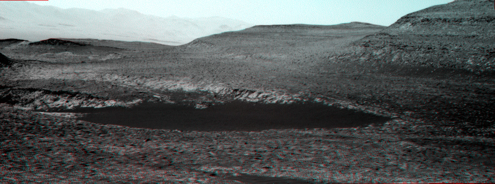
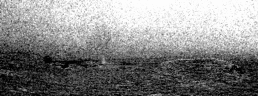
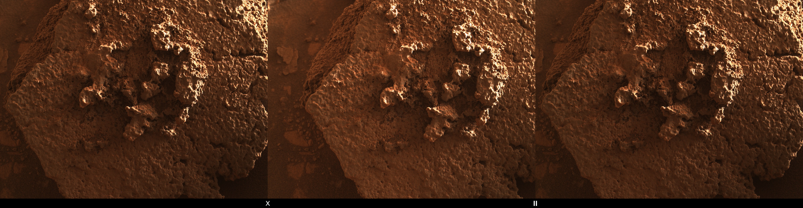
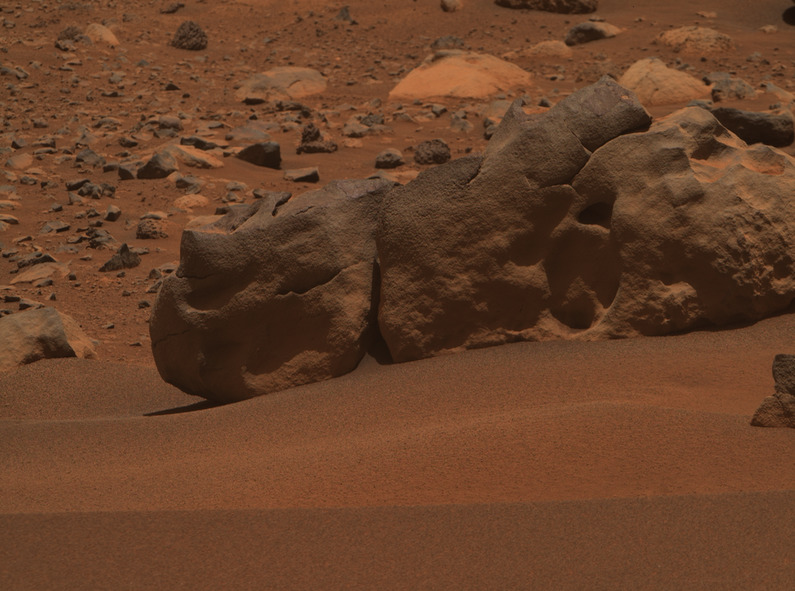
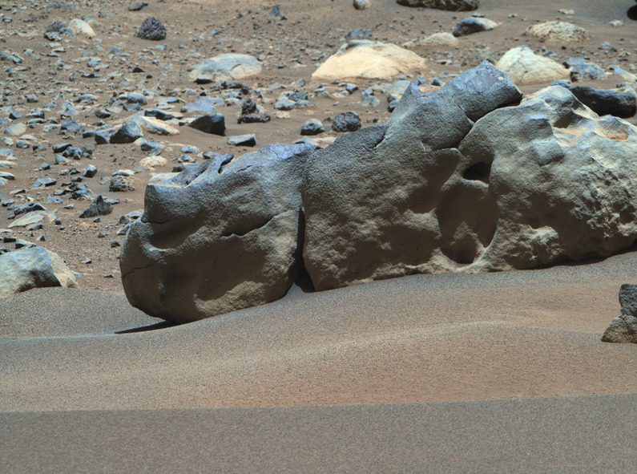

# Mars Raw Image Utilities
[](https://github.com/kmgill/mars-raw-utils/actions/workflows/rust.yml)

Mars Raw Utils (MRU) is a set of utilities for the retrieval, calibration, and manipulation of publically available raw Mars surface mission imagery. It is not meant or intended to work with or produce full comprehensive science products (that is left to the NASA Planetary Data System and traditional image processing toolsets), instead provide tools for the enthusiast and "Citizen Scientist" communities to streamline, standardize, and teach the operations generally used for flight mission image processing. 

MRU supports three flight missions currently or recently in operation on the ground on Mars. Data is sourced from the NASA Raw Image browse web services that are otherwise available in the web browser. 

Supported Missions and Data Sources:
* Mars Perseverance Rover (Mars2020): https://mars.nasa.gov/mars2020/multimedia/raw-images/
* Mars Curiosity Rover (Mars Science Laboratory): https://mars.nasa.gov/msl/multimedia/raw-images/
* Mars InSight Lander (legacy): https://mars.nasa.gov/insight/multimedia/raw-images/

Though not comprehensive, MRU aims to provide image calibration with the goal of achieving an output as close as possible to the full science data. The primary limitation being that prior to becoming available online, most images are converted to web-friendly formats that involve downscaling, lossy compression, and other changes that result in a loss of data precision. 

Currently supported camera instruments and primary calibration functions:

| Mission    |     Camera  | Decompand | Debayer | Inpaint      | Flats  | HPC*   |
| ---------- |:-----------:|:---------:|:-------:|:------------:|:------:|:------:|
| MSL        | MastCam     | &#9745;   | &#9745; |              |        |        |
| MSL        | MAHLI       | &#9745;   |         | &#9745;      | &#9745;| &#9745;|
| MSL        | NavCam**    |           |         | &#9745;      | &#9745;| &#9745;|
| MSL        | Rear Haz    |           |         | &#9745;      | &#9745;| &#9745;|
| MSL        | Front Haz   |           |         | &#9745;      | &#9745;| &#9745;|
| MSL        | ChemCam RMI |           |         |              | &#9745;|        |
| Mars2020   | Mastcam-Z   | &#9745;   | &#9745; | &#9745;      | &#9745;|        |
| Mars2020   | NavCam      | &#9745;   | &#9745; |              | &#9745;|        |
| Mars2020   | Rear Haz    | &#9745;   | &#9745; |              | &#9745;|        |
| Mars2020   | Front Haz   | &#9745;   | &#9745; |              | &#9745;|        |
| Mars2020   | Watson      | &#9745;   | &#9745; | &#9745;      | &#9745;|        |
| Mars2020   | SuperCam    | &#9745;   | &#9745; |              | &#9745;|        |
| Mars2020   | PIXL MCC    |           |         |              | &#9745;|        |
| Mars2020   | SkyCam      |           |         |              | &#9745;| &#9745;|
| Mars2020   | SHERLOC ACI |           |         |              | &#9745;|        |
| Mars2020   | RDCAM       |           | &#9745; |              | &#9745;|        |
| Ingenuity  | Nav         |           |         |              | &#9745;|        |
| Ingenuity  | Color       |           |         |              | &#9745;|        |
| InSight    | IDC         | &#9745;   |         |              | &#9745;|        |
| InSight    | ICC         | &#9745;   |         |              | &#9745;|        |


\* Hot pixel detection and correction

\** For the purposes of this project, the cameras on MSL RCE-A have been ignored as the mission is very unlikely to return to that computer.

Additional instruments will be implemented more or less whenever I get to them.

## Quick Start
Check out the wiki for some quick start topics: https://github.com/kmgill/mars-raw-utils/wiki

## Contributing
Feedback, issues, and contributions are always welcomed. Should enough interest arise in contributing development efforts, I will write up a contribution guide. 

## Citing Mars Raw Utils
Citing MRU is not required, but if the software has significantly contributed to your research or if you'd like to acknowledge the project in your works, I would be grateful if you did so.  

## Building from source
A working Rust (https://www.rust-lang.org/) installation is required for building. MRU targets the 2021 edition, stable branch. 

MRU is build and tested on Linux (Fedora, Ubuntu, Kubuntu), MacOS, and Windows (natively and WSL2.0)

To build successfully on Linux, you'll likely need the following packages installed via apt:
* `libssl-dev` (Ubuntu)
* `openssl-devel` (RHEL, CentOS, Fedora)

### Clone from git
```bash
git clone git@github.com:kmgill/mars-raw-utils.git
cd mars-raw-utils/
```

### Install via cargo
This is the easiest installation method for *nix-based systems, though it does require a working installation of the Rust toolchain. While the software does build and run natively on Windows, it is recommended to be used within a Ubuntu container on the Windows Subsystem for Linux.

```bash
cargo install --path .
mkdir ~/.marsdata
cp mars-raw-utils-data/caldata/* ~/.marsdata
```
NOTE: You can set `$MARS_RAW_DATA` in `~/.bash_profile` if a custom data directory is required.

### Install via apt (Debian, Ubuntu, ...)
Download the pre-built deb file from the project page.

```
sudo apt install ./mars_raw_utils_0.7.0_amd64.deb
```
NOTE: Adjust the output debian package filename to what is output by the build.

### Install via rpm (RHEL, CentOS, Fedora, ...)
Download the pre-built rpm file from the project page.
```bash
rpm -ivh mars_raw_utils-0.7.0-1.x86_64.rpm
```
NOTE: Adjust the output rpm package filename to what is created by build.

### Install on MacOS via Homebrew
```bash
brew tap kmgill/homebrew-mars-raw-utils
brew install marsrawutils
```

### Docker
A prebuilt docker image is available for use:
```bash
docker pull kevinmgill/mars_raw_utils:latest
```

However, the container can also be built locally:
```bash
sh dockerbuild.sh
```


### Building Install Packages using Docker
Install packages for MRU are currently built within Docker containers and are kicked off thusly:
```bash
# Fedora / Red Hat:
sh dockerbuild-fedora.sh

# Debian / Ubuntu:
sh dockerbuild-debian.sh
```
Build outputs will be placed into the `target` directory.

## Specifying Calibration Data Location
By default, if the software is installed using the .deb file in Debian/Ubuntu, the calibration files will be located in `/usr/share/mars_raw_utils/data/`. In Homebrew on MacOS, they will be located in `/usr/local/share/mars_raw_utils/data/`. For installations using `cargo install --path .` or custom installations, you can use the default `~/.marsdata` or set the calibration file directory by using the `$MARS_RAW_DATA` environment variable. The variable will override the default locations (if installed via apt or rpm), as well.

## Updating Calibration Data
Once MRU is installed, or if a update is available, the calibration files can be updated by running::
```bash
mru update-cal-data
```

## Calibration Profiles
Calibration files are used to specify commonly used parameters for the various instruments and output product types. The files are in toml format and if not specified by their absolute path, need to be discoverable in a known calibration folder.

An example profile 
```ini
calfiletype = "profile"
apply_ilt = true
red_scalar = 1.0
green_scalar = 0.96
blue_scalar = 1.2095
color_noise_reduction = false
color_noise_reduction_amount = 0
hot_pixel_detection_threshold = 0
filename_suffix = "rjcal-dcc"
decorrelate_color = true
mission = "Mars2020"
instrument = "WATSON"
description = "Applies color decorrelation to RAD calibrated images"
```

### Included calibration profiles
 * m20_cachecam_ilt
 * m20_cachecam_rad
 * m20_hrte_rad
 * m20_ncam_bay
 * m20_ncam_dcc
 * m20_ncam_drcx
 * m20_ncam_ilt
 * m20_ncam_mcz
 * m20_ncam_rad
 * m20_scam_bay
 * m20_scam_dcc
 * m20_scam_ilt
 * m20_scam_rad
 * m20_watson_bay
 * m20_watson_dcc
 * m20_watson_drcx
 * m20_watson_ilt
 * m20_watson_rad
 * m20_zcam_bay
 * m20_zcam_ilt
 * m20_zcam_rad
 * m20_zcam_cwb
 * m20_zcam_cb2
 * m20_zcam_dcc
 * m20_zcam_drcx
 * msl_mahli_bay
 * msl_mahli_ilt
 * msl_mahli_rad
 * msl_mahli_cwb
 * msl_mahli_dcc
 * msl_mahli_drcx
 * msl_mahli_drxx
 * msl_mcam_bay
 * msl_mcam_ilt
 * msl_mcam_rad
 * msl_mcam_dcc
 * msl_mcam_drcx
 * msl_mcam_drxx

## Calibration
Images posted to the NASA raw image pages are derived from what are known as Experimental Data Records (EDR). Not having gone through the ground pipelines, these images are raw and unprocessed. Further, the images have had various levels of compression applied to make them easier to serve on a website. 

This tool provides a way to apply some of the steps required to generate a calibrated data product. Given the compression applied, it is impossible to produce a completely calibrated image on par with those in JPL's internal systems or the planetary data system. However, this best-effort calibration tool was developed to provide products suitable for image processing enthusiasts and some limited utility for researchers. 

### Running
This tool uses associated metadata to identify the calibration routine required for a given mission and instrument (see list of supported instruments above). A such, this is the single subcommand for calibration. 

To execute the default calibration on a set of images (modify input expression as required):
```bash
mru calibrate -i *jpg
```


To calibrate a set of images and apply a specific calibration profile, in this case `msl_mcam_rad`, run:
```bash
mru calibrate -i *jpg -P msl_mcam_rad
```

### Usage
```
Usage: mru calibrate [OPTIONS]

Options:
  -i, --input-files <INPUT_FILES>...
          Input raw images
  -I, --instrument <INSTRUMENT>
          Force instrument
  -R, --red-weight <RED_WEIGHT>
          Red weight
  -G, --green-weight <GREEN_WEIGHT>
          Green weight
  -B, --blue-weight <BLUE_WEIGHT>
          Blue weight
  -r, --raw
          Raw color, skip ILT
  -c, --color-noise-reduction-amount <COLOR_NOISE_REDUCTION_AMOUNT>
          Color noise reduction amount
  -t, --hpc-threshold <HPC_THRESHOLD>
          HPC threshold
  -w, --hpc-window <HPC_WINDOW>
          HPC window size
  -d, --decorrelate
          Decorrelate color channels
  -P, --profile <PROFILE>...
          Calibration profile
  -D, --debayer <DEBAYER>
          Debayer method (malvar, amaze)
  -C, --srgb-color-correction
          Apply sRGB color correction
  -S, --no-subframing
          Skip auto subframing (cropping) of output images
  -h, --help
          Print help
  -V, --version
          Print version
```

## Fetch Raws for MSL
This tool fetches images from the public raw image website at https://mars.nasa.gov/msl/multimedia/raw-images/

### Usage
```
USAGE:
    mru msl-fetch [OPTIONS]

OPTIONS:
    -c, --camera <CAMERA>...    MSL Camera Instrument(s)
    -h, --help                  Print help information
    -I, --instruments           List instruments
    -l, --list                  Don't download, only list results
    -m, --minsol <MINSOL>       Starting Mission Sol
    -M, --maxsol <MAXSOL>       Ending Mission Sol
    -n, --new                   Only new images. Skipped processed images.
    -N, --num <NUM>             Max number of results
    -o, --output <OUTPUT>       Output directory
    -p, --page <PAGE>           Results page (starts at 1)
    -s, --sol <SOL>             Mission Sol
    -S, --seqid <SEQID>         Sequence ID
    -t, --thumbnails            Download thumbnails in the results
    -V, --version               Print version information
```

### Instrument Identifiers
Top level idenfiers include those in the sublevels.
* NAV_LEFT
  *  NAV_LEFT_A
  * NAV_LEFT_B
* MAHLI
* NAV_RIGHT
  * NAV_RIGHT_A
  * NAV_RIGHT_B
* CHEMCAM
  * CHEMCAM_RMI
* MARDI
* HAZ_REAR
  * RHAZ_RIGHT_A
  * RHAZ_LEFT_A
  * RHAZ_RIGHT_B
  * RHAZ_LEFT_B
* MASTCAM
  * MAST_LEFT
  * MAST_RIGHT
* HAZ_FRONT
  * FHAZ_RIGHT_A
  * FHAZ_LEFT_A
  * FHAZ_RIGHT_B
  * FHAZ_LEFT_B

### Examples

Show available instruments:
```bash
mru msl-fetch -I
```

List what's available for Mastcam on sol 3113: (remove the `-l` to download the images)
```bash
mru msl-fetch -c MASTCAM -s 3113 -l
```

List what's available for NAV_RIGHT between sols 3110 and 3112: (remove the `-l` to download the images)
```bash
mru msl-fetch -c NAV_RIGHT -m 3110 -M 3112 -l
```

Download NAV_RIGHT during sols 3110 through 3112, filtering for sequence id NCAM00595:
```bash
mru msl-fetch -c NAV_RIGHT -m 3110 -M 3112 -S NCAM00595
```


## Fetch Raws for Mars2020
This tool fetches images from the public raw image website at https://mars.nasa.gov/mars2020/multimedia/raw-images/

### Usage
```
USAGE:
    mru m20-fetch [OPTIONS]

OPTIONS:
    -c, --camera <CAMERA>...    Mars2020 Camera Instrument(s)
    -e, --movie                 Only movie frames
    -h, --help                  Print help information
    -I, --instruments           List instruments
    -l, --list                  Don't download, only list results
    -m, --minsol <MINSOL>       Starting Mission Sol
    -M, --maxsol <MAXSOL>       Ending Mission Sol
    -n, --new                   Only new images. Skipped processed images.
    -N, --num <NUM>             Max number of results
    -o, --output <OUTPUT>       Output directory
    -p, --page <PAGE>           Results page (starts at 1)
    -s, --sol <SOL>             Mission Sol
    -S, --seqid <SEQID>         Sequence ID
    -t, --thumbnails            Download thumbnails in the results
    -V, --version               Print version information
```
### Instrument Identifiers
Top level idenfiers include those in the sublevels.
* MASTCAM
  * MCZ_LEFT
  * MCZ_RIGHT
* NAVCAM
  * NAVCAM_LEFT
  * NAVCAM_RIGHT
* HELI_RTE
* CACHECAM
* SKYCAM
* EDLCAM
  * EDL_DDCAM
  * EDL_PUCAM1
  * EDL_PUCAM2
  * EDL_RUCAM
  * EDL_RDCAM
  * LCAM
* SHERLOC
  * SHERLOC_ACI
* HELI_NAV
* WATSON
  * SHERLOC_WATSON
* HAZ_FRONT
  * FRONT_HAZCAM_LEFT_A
  * FRONT_HAZCAM_LEFT_B
  * FRONT_HAZCAM_RIGHT_A
  * FRONT_HAZCAM_RIGHT_B
* SUPERCAM
  * SUPERCAM_RMI
* PIXL
  * PIXL_MCC
* HAZ_REAR
  * REAR_HAZCAM_LEFT
  * REAR_HAZCAM_RIGH


## Fetch Raws for InSight
This tool fetches images from the public raw image website at https://mars.nasa.gov/insight/multimedia/raw-images/

*NOTE*: The InSight mission has come to an end. Because of this, no new images will be appearing on the raw image website beyond what it already there.


### Usage
```
USAGE:
    mru nsyt-fetch [OPTIONS]

OPTIONS:
    -c, --camera <CAMERA>...    InSight Camera Instrument(s)
    -h, --help                  Print help information
    -I, --instruments           List instruments
    -l, --list                  Don't download, only list results
    -m, --minsol <MINSOL>       Starting Mission Sol
    -M, --maxsol <MAXSOL>       Ending Mission Sol
    -n, --new                   Only new images. Skipped processed images.
    -N, --num <NUM>             Max number of results
    -o, --output <OUTPUT>       Output directory
    -p, --page <PAGE>           Results page (starts at 1)
    -s, --sol <SOL>             Mission Sol
    -S, --seqid <SEQID>         Sequence ID
    -t, --thumbnails            Download thumbnails in the results
    -V, --version               Print version information
```

### Instrument Identifiers
* ICC
* IDC

## Anaglyph
Generate a red/blue anaglyph from a matching stereo pair.
```
Usage: mru anaglyph [OPTIONS] --left <LEFT> --right <RIGHT> --output <OUTPUT>

Options:
  -l, --left <LEFT>      Left image
  -r, --right <RIGHT>    Right image
  -o, --output <OUTPUT>  Output image
  -m, --mono             Monochrome color (before converting to red/blue)
  -h, --help             Print help
  -V, --version          Print version
```

### Example:
Generate an analyph from a sol 3931 ENV sequence stereo pair:

```bash
mru msl-fetch -c NAV_RIGHT NAV_LEFT -s 3931 -f NCAM00593

mru calibrate -i /data/MSL/3931/NCAM/NLB_746463314EDR_S1031742NCAM00593M_.JPG /data/MSL/3931/NCAM/NRB_746463314EDR_S1031742NCAM00593M_.JPG

mru anaglyph -l /data/MSL/3931/NCAM/NLB_746463314EDR_S1031742NCAM00593M_-rjcal.tif  -r /data/MSL/3931/NCAM/NRB_746463314EDR_S1031742NCAM00593M_-rjcal.tif -o MSL_NCAM_3931_anaglyph_1.tif


```

Output:
<p align="center">
  
</p>

## Hot Pixel Correction Filter
Attempt at hot pixel detection and removal. 

Method:

For each pixel (excluding image border pixels):
 1. Compute the standard deviation of a window of pixels (3x3, say)
 1. Compute the z-score for the target pixel
 1. If the z-score exceeds a threshold variance (example: 2.5) from the mean we replace the pixel value with a median filter

```
Usage: mru hpc-filter [OPTIONS]

Options:
  -i, --input-files <INPUT_FILES>...  Input images
  -t, --threshold <THRESHOLD>         HPC threshold
  -w, --window <WINDOW>               HPC window size
  -h, --help                          Print help
  -V, --version                       Print version
```

## Inpainting Filter
Applies a basic inpainting filter on a set of input images. Inpainting regions need to be marked in red (rgb 255, 0, 0).
```
Usage: mru inpaint [OPTIONS]

Options:
  -i, --input-files <INPUT_FILES>...  Input images
  -h, --help                          Print help
  -V, --version                       Print version
```


## Crop
```
USAGE:
    mru crop [OPTIONS] --crop <CROP>

OPTIONS:
    -c, --crop <CROP>                     Crop as x,y,width,height
    -h, --help                            Print help information
    -i, --input-files <INPUT_FILES>...    Input images
    -V, --version                         Print version information
```

## Debayer
Apply Malvar or Amaze Demosaicking (Debayer) on a grayscale bayer-pattern image. Optionally apply a color noise reduction.
```
Usage: mru debayer [OPTIONS]

Options:
  -i, --input-files <INPUT_FILES>...  Input images
  -D, --debayer <DEBAYER>             Debayer method (malvar, amaze)
  -h, --help                          Print help
  -V, --version                       Print version                      Print version information
```


## Levels
Apply levels adjustments to an image. Analogous to 'Levels' in Photoshop or GIMP. 
```
Usage: mru levels [OPTIONS]

Options:
  -i, --input-files <INPUT_FILES>...  Input images
  -b, --black <BLACK>                 Black level
  -w, --white <WHITE>                 White level
  -g, --gamma <GAMMA>                 Gamma level
  -h, --help                          Print help
  -V, --version                       Print version
```

## Change Detection (Dust devils, clouds)
Calculates a per-frame differential from a mean across a series of images. Intended for use with MSL and Mars2020 dust devil movies and sky surveys. Optional options are for contrast enhancement through Photoshop-like black level, white level, and gamma. 

```
Usage: mru diffgif [OPTIONS] --output <OUTPUT>

Options:
  -i, --input-files <INPUT_FILES>...  Input images
  -b, --black <BLACK>                 Black level
  -w, --white <WHITE>                 White level
  -g, --gamma <GAMMA>                 Gamma level
  -d, --delay <DELAY>                 Interframe delay in increments of 10ms
  -l, --lowpass <LOWPASS>             Lowpass window size
  -o, --output <OUTPUT>               Output image
  -p, --prodtype <PRODTYPE>           Product type
  -m, --mono                          Convert RGB to mono
  -L, --lightonly                     Light only, discard dark values
  -h, --help                          Print help
  -V, --version                       Print version

```

### Examples
#### Dust Devils, MSL Sol 3372, Seq id NCAM00595
```bash
mru msl-fetch -c NAV_RIGHT_B -s 3372 -f NCAM00595

mru calibrate -i *JPG -t 2.0

mru diffgif -i *NCAM00595*-rjcal.tif -o DustDevilMovie_Sol3372.gif -b 0 -w 2.0 -g 2.5 -l 5 -d 20
```

Output:

<p align="center">
   
</p>


#### Cloud motion and shadows, MSL Sol 3325, Seq id NCAM00556
```bash
mru msl-fetch -c NAV_RIGHT -s 3325

mru calibrate -i *JPG -t 2.0

mru diffgif -i *NCAM00556*-rjcal.tif -o CloudShadow_3325.gif -b 0 -w 1.0 -g 2.5 -l 5 -d 20
```
#### Clouds, zenith movie, MSL Sol 3325, Seq id NCAM00551
```bash
mru msl-fetch -c NAV_RIGHT -s 3325

mru calibrate -i *JPG -t 2.0

mru diffgif -i *NCAM00551*-rjcal.tif -o CloudZenith_3325.gif -b 0 -w 3.0 -g 1.0 -l 5 -d 20
```

## Data Update Checks
Fetches information as to the latest updated sols.

Example Output:
```bash
$ mru msl-latest
Latest data: 2022-02-23T18:30:03Z
Latest sol: 3395
Latest sols: [3365, 3374, 3376, 3378, 3390, 3393, 3394, 3395]
New Count: 364
Sol Count: 225
Total: 894201

$ mru m20-latest
Latest data: 2022-02-23T10:22:33Z
Latest sol: 359
Latest sols: [349]
New Count: 270
Sol Count: 99
Total: 217981

$ mru nsyt-latest
Latest data: 2022-02-14T15:11:15Z
Latest sol: 1144
Latest sols: [1144]
New Count: 2
Sol Count: 2
Total: 6353
```


## Mission Dates
Mission time and sol are available for MSL, Mars2020, InSight, and the Mars Exploration Rovers via `msl_date`, `m20_date`, `nsyt_date`, and `mer-date` respectively. 

Currently, the output provides valules for the Mars Sol Date, coordinated Mars time, mission sol, mission time (LMST/HLST), local true color time, and areocentric solar longitude. The algorithm used for the calculation is based on James Tauber's marsclock.com and is exposed via `time::get_time(sol_offset:f64, longitude:f64, time_system:time::TimeSystem)`.

Example Output:
```bash
$ mru msl-date
Mars Sol Date:          52391.26879394437
Coordinated Mars Time:  06:27:03.797
Mission Sol:            3122
Mission Time:           15:36:49.805 LMST
Local True Solar Time:  15:29:37.673 LTST
Solar Longitude:        47.04093399663567

$ mru m20-date
Mars Sol Date:          52391.270293050664
Coordinated Mars Time:  06:29:13.320
Mission Sol:            87
Mission Time:           11:38:56.520 LMST
Local True Solar Time:  11:31:44.417 LTST
Solar Longitude:        47.04161842268443

$ mru nsyt-date 
Mars Sol Date:          52391.27048977531
Coordinated Mars Time:  06:29:30.317
Mission Sol:            880
Mission Time:           15:31:59.933 LMST
Local True Solar Time:  15:24:47.833 LTST
Solar Longitude:        47.041708238462114

$ mru mer-date
MER-A / Spirit:
Mars Sol Date:          52818.42509854407
Coordinated Mars Time:  10:12:08.514
Mission Sol:            6602
Mission Time:           10:12:08.514 LMST
Local True Solar Time:  09:52:00.678 LTST
Solar Longitude:        276.7135713289173
-----------------------------------------------
MER-B / Opportunity:
Mars Sol Date:          52818.42509854497
Coordinated Mars Time:  10:12:08.514
Mission Sol:            6583
Mission Time:           09:11:02.476 LMST
Local True Solar Time:  08:50:54.640 LTST
Solar Longitude:        276.7135713294991
```

## Focus Merge
A tool for focus stacking a series of images taken on the same scene but at different focal distances with the intent of simulating a greater depth of field. This is commonly done with MSL MAHLI (usually stacked on-board the rover then downlinked with an derived depth map).

The tool takes an input of 2+ images and an output location. An optional parameter allows for tuning the window size when determining the quality sigma value (default: 15).


```
Usage: mru focus-merge [OPTIONS] --output <OUTPUT>

Options:
  -i, --input-files <INPUT_FILES>...  Input images
  -o, --output <OUTPUT>               Output image
  -w, --window <WINDOW>               Quality determination window size (pixels)
  -d, --depth-map                     Produce a depth map
  -h, --help                          Print help
  -V, --version                       Print version
```

## Cross-eye Stereograms
This provides the capability for MRU to produce cross-eye/parallel-eye 3D stereograms. 

```
Usage: mru xeye [OPTIONS] --left <LEFT> --right <RIGHT> --output <OUTPUT>

Options:
  -l, --left <LEFT>      Left image
  -r, --right <RIGHT>    Right image
  -o, --output <OUTPUT>  Output image
  -u, --use-cm           Use camera model, if available
  -h, --help             Print help
  -V, --version          Print version
```

### Example:
Download MAHLI stereo pair from sol 3931, calibrate them, then create a cross-eye stereogram:
```bash
mru msl-fetch -c MAHLI -s 3931

mru calibrate -i 3931MH0001700001402361R00_DXXX.jpg 3931MH0001700001402363R00_DXXX.jpg -P msl_mahli_rad

mru xeye -l 3931MH0001700001402363R00_DXXX-rjcal-rad.tif -r 3931MH0001700001402361R00_DXXX-rjcal-rad.tif -o MSL_MAHLI_3931_xeye_1.tif
```

Output:
<p align="center">
   
</p>


## Color Decorrelation Stetching
Stretches each color band of an image independent of one another to the minimum and maximum values of the bit depth.

```
Usage: mru decorr [OPTIONS]

Options:
  -i, --input-files <INPUT_FILES>...  Input images
  -c, --cross-file                    Cross-File decorrelation (value ranges determined across all files rather than individually)
  -b, --ignore-black                  Ignore black values
  -h, --help                          Print help
  -V, --version                       Print version
```

Example Before (M20 MCZ calibrated with `m20_zcam_rad`)
<p align="center">
  
</p>

Example After following `mru decorr`
<p align="center">
  
</p>

## Mars Relay Network Pass Information
Retrieve overflight and downlink information from the Mars Relay Network. Information can be filtered by lander (`M20`, `MSL`), and/or orbiter (`MRO`, `ODY`, `TGO`, `MVN`).

```
Usage: mru passes [OPTIONS]

Options:
  -o, --orbiter <ORBITER>...  Limit to orbiter(s)
  -l, --lander <LANDER>...    Limit to lander(s)
  -f, --future                Limit to future overflights
  -h, --help                  Print help
  -V, --version               Print version
```

### Example:

Retrieve upcoming passes for Curiosity:
```bash
mru passes -l MSL -f
+---------------------+---------+--------+-------------------------+--------------+----------+---------+----------+
| ID                  | Orbiter | Lander | Max El Time             | Max El (deg) | Duration | Range   | Data Vol |
+---------------------+---------+--------+-------------------------+--------------+----------+---------+----------+
| TGO_MSL_2023_242_03 | TGO     | MSL    | 2023-08-30 18:20:01 UTC | 33.448813    | 16.566   | 635.226 | 710      |
+---------------------+---------+--------+-------------------------+--------------+----------+---------+----------+
| MRO_MSL_2023_242_02 | MRO     | MSL    | 2023-08-30 20:40:32 UTC | 72.00407     | 13.5     | 277.561 | 397      |
+---------------------+---------+--------+-------------------------+--------------+----------+---------+----------+
| ODY_MSL_2023_243_02 | ODY     | MSL    | 2023-08-31 12:13:00 UTC | 70.262318    | 17.316   | 426.163 | 114      |
+---------------------+---------+--------+-------------------------+--------------+----------+---------+----------+
| MRO_MSL_2023_243_03 | MRO     | MSL    | 2023-08-31 20:59:15 UTC | 30.584128    | 12.933   | 474.955 | 211      |
+---------------------+---------+--------+-------------------------+--------------+----------+---------+----------+
...
```

## Rover Surface Location and Waypoint Information
Fetches drive, location, and vehicle attitude information. 

### Curiosity
```
Usage: mru msl-location [OPTIONS]

Options:
  -a, --all      Print all known waypoints
  -c, --csv      Print CSV format
  -h, --help     Print help
  -V, --version  Print version
```

#### Example:

Current vehicle status:

```bash
mru msl-location
Site: 103
Drive: 2216
Sol: 3931
Easting: 8144432.505
Northing: -282950.238
Elevation (geoid): -3777.79
Longitude: 137.4015026
Latitude: -4.77354166
Roll: -10.81
Pitch: 1.8
Yaw: 134.87
Tilt: 10.96
Drive Distance (meters): 64.63
Total Traverse Distance (kilometers): 30.78
```

### Perseverance

```
Usage: mru m20-location [OPTIONS]

Options:
  -a, --all      Print all known waypoints
  -c, --csv      Print CSV format
  -h, --help     Print help
  -V, --version  Print version
```

#### Example:

Current vehicle status:

```bash
mru m20-location
Site: 44
Drive: 830
Sol: 897
Easting: 4349292.079
Northing: 1095551.419
Elevation (geoid): -2414.699463
Longitude: 77.35836062
Latitude: 18.48261509
Roll: -1.581429204
Pitch: 0.356870366
Yaw: -94.94701482
Tilt: 1.621185506
Drive Distance (meters): 0.047
Total Traverse Distance (kilometers): 19.93
```

## Converting PDS images to MRU-readable Format
This provides a simple utility for converting archived VICAR images from the Planetary Data System (PDS) into a format readable by MRU.

```
Usage: mru pds2png [OPTIONS]

Options:
  -i, --input-files <INPUT_FILES>...  Input images
  -m, --min <MIN>                     Minimum value
  -M, --max <MAX>                     Maximum value
  -x, --minmax                        Prints minimum and maximum values then exit
  -h, --help                          Print help
  -V, --version                       Print version
```

## References

Bell, J. F. et al. (2017), The Mars Science Laboratory Curiosity rover
Mastcam instruments: Preflight and in‐flight calibration, validation,
and data archiving, Earth and Space Science, 4, 396– 452,
doi:10.1002/2016EA000219.
https://doi.org/10.1002/2016EA000219


Hayes, A.G., Corlies, P., Tate, C. et al.
Pre-Flight Calibration of the Mars 2020 Rover Mastcam Zoom (Mastcam-Z)
Multispectral, Stereoscopic Imager. Space Sci Rev 217, 29 (2021).
https://doi.org/10.1007/s11214-021-00795-x


Edgett, K.S., Yingst, R.A., Ravine, M.A. et al.
Curiosity’s Mars Hand Lens Imager (MAHLI) Investigation.
Space Sci Rev 170, 259–317 (2012).
https://doi.org/10.1007/s11214-012-9910-4


Edgett, K. S., M. A. Caplinger, J. N. Maki, M. A. Ravine, F. T. Ghaemi, S. McNair, K. E. Herkenhoff,
B. M. Duston, R. G. Willson, R. A. Yingst, M. R. Kennedy, M. E. Minitti, A. J. Sengstacken, K. D. Supulver,
L. J. Lipkaman, G. M. Krezoski, M. J. McBride, T. L. Jones, B. E. Nixon, J. K. Van Beek, D. J. Krysak, and R. L. Kirk
(2015) Curiosity’s robotic arm-mounted Mars Hand Lens Imager (MAHLI): Characterization and calibration status,
MSL MAHLI Technical Report 0001 (version 1: 19 June 2015; version 2: 05 October 2015).
doi:10.13140/RG.2.1.3798.5447
https://doi.org/10.13140/RG.2.1.3798.5447


Deen, R., Zamani, P., Abarca, H., Maki, J. InSight (NSYT)
Software Interface Specification Camera Experiment Data Record (EDR) and Reduced Data Record (RDR) Data
Products (version 3.3: 26 June 2019)
https://pds-imaging.jpl.nasa.gov/data/nsyt/insight_cameras/document/insight_cameras_sis.pdf


Edgett, Kenneth & Caplinger, Michael & Ravine, Michael. (2019). Mars 2020 Perseverance SHERLOC WATSON Camera Pre-delivery Characterization and Calibration Report. 10.13140/RG.2.2.18447.00165. 
https://www.researchgate.net/publication/345959204_Mars_2020_Perseverance_SHERLOC_WATSON_Camera_Pre-delivery_Characterization_and_Calibration_Report


Maurice, Sylvestre & Wiens, R. & Mouélic, S. & Anderson, R. & Beyssac, O. & Bonal, L. & Clegg, S. & Deflores, L. & Dromart, G. & Fischer, W. & Forni, O. & Gasnault, O. & Grotzinger, J. & Johnson, Jordanlee & Martínez-Frías, Jesús & Mangold, N. & McLennan, S. & Montmessin, F. & Rull, Fernando & Sharma, Shiv. (2015). The SuperCam Instrument for the Mars2020 Rover. European Planetary Science Congress 2015. 10. 
https://www.researchgate.net/publication/283271532_The_SuperCam_Instrument_for_the_Mars2020_Rover


J. -M. Reess, Marion Bonafous, L. Lapauw, O. Humeau, T. Fouchet, P. Bernardi, Ph. Cais, M. Deleuze, O. Forni, S. Maurice, S. Robinson, R. C. Wiens, "The SuperCam infrared instrument on the NASA MARS2020 mission: performance and qualification results," Proc. SPIE 11180, International Conference on Space Optics — ICSO 2018, 1118037 (12 July 2019); 
https://doi.org/10.1117/12.2536034


Wiens, R.C., Maurice, S., Barraclough, B. et al. The ChemCam Instrument Suite on the Mars Science Laboratory (MSL) Rover: Body Unit and Combined System Tests. Space Sci Rev 170, 167–227 (2012). 
https://doi.org/10.1007/s11214-012-9902-4


O. Gasnault, S. Maurice, R. C. Wiens, S. Le Mouélic, W. W. Fischer, P. Caïs, K. McCabe, J.-M. Reess, and C. Virmontois 
"SUPERCAM REMOTE MICRO-IMAGER ON MARS 2020." - 46th Lunar and Planetary Science Conference (2015).
https://www.hou.usra.edu/meetings/lpsc2015/pdf/2990.pdf


Telea, Alexandru. (2004). An Image Inpainting Technique Based on the Fast Marching Method. Journal of Graphics Tools. 9. 10.1080/10867651.2004.10487596. 
https://www.researchgate.net/publication/238183352_An_Image_Inpainting_Technique_Based_on_the_Fast_Marching_Method


Malvar, Henrique & He, Li-wei & Cutler, Ross. (2004). High-quality linear interpolation for demosaicing of Bayer-patterned color images. Acoustics, Speech, and Signal Processing, 1988. ICASSP-88., 1988 International Conference on. 3. iii - 485. 10.1109/ICASSP.2004.1326587. 
https://www.researchgate.net/publication/4087683_High-quality_linear_interpolation_for_demosaicing_of_Bayer-patterned_color_images


Getreuer, Pascal. (2011). Malvar-He-Cutler Linear Image Demosaicking. Image Processing On Line. 1. 10.5201/ipol.2011.g_mhcd. 
https://www.researchgate.net/publication/270045976_Malvar-He-Cutler_Linear_Image_Demosaicking


Maki, J.N., Gruel, D., McKinney, C. et al. The Mars 2020 Engineering Cameras and Microphone on the Perseverance Rover: A Next-Generation Imaging System for Mars Exploration. Space Sci Rev 216, 137 (2020). 
https://doi.org/10.1007/s11214-020-00765-9


Malin, M. C., et al. (2017), The Mars Science Laboratory (MSL) Mast cameras and Descent imager: Investigation and instrument descriptions, Earth and Space Science, 4, 506– 539, doi:10.1002/2016EA000252.
https://doi.org/10.1002/2016EA000252


Di, K., and Li, R. (2004), CAHVOR camera model and its photogrammetric conversion for planetary applications, J. Geophys. Res., 109, E04004, doi:10.1029/2003JE002199.
https://doi.org/10.1029/2003JE002199

Castano, A., Fukunaga, A., Biesiadecki, J. et al. Automatic detection of dust devils and clouds on Mars. Machine Vision and Applications 19, 467–482 (2008). https://doi.org/10.1007/s00138-007-0081-3


Allwood, Abigail C., Joel A. Hurowitz, Benton C. Clark, Luca Cinquini, Scott Davidoff, Robert W. Denise,
W. Timothy Elam, et al. "The PIXL Instrument on the Mars 2020 Perseverance Rover." arXiv preprint
arXiv:2103.07001 (2021). https://arxiv.org/abs/2103.07001

Gennery, D.B. Generalized Camera Calibration Including Fish-Eye Lenses. Int J Comput Vision 68, 239–266 (2006). https://doi.org/10.1007/s11263-006-5168-1

Fries, M.D., Lee, C., Bhartia, R. et al. The SHERLOC Calibration Target on the Mars 2020 Perseverance Rover: Design, Operations, Outreach, and Future Human Exploration Functions. Space Sci Rev 218, 46 (2022). https://doi.org/10.1007/s11214-022-00907-1